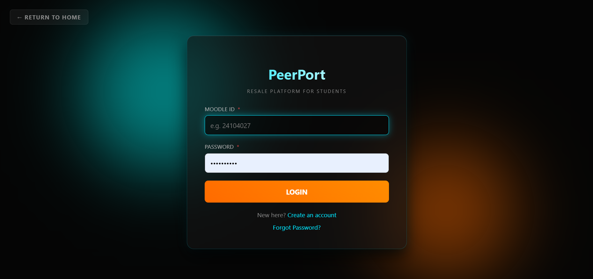
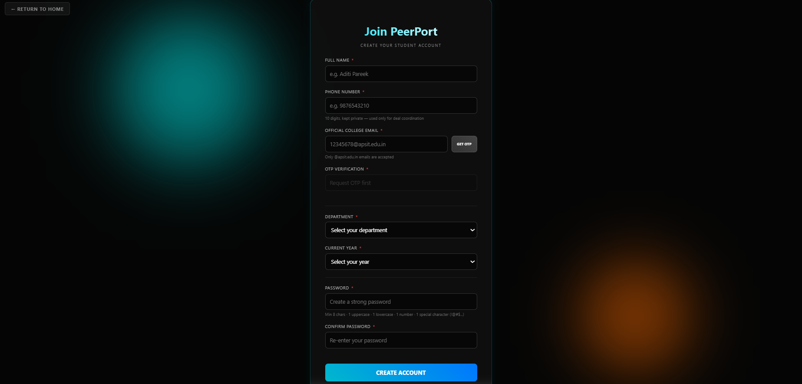
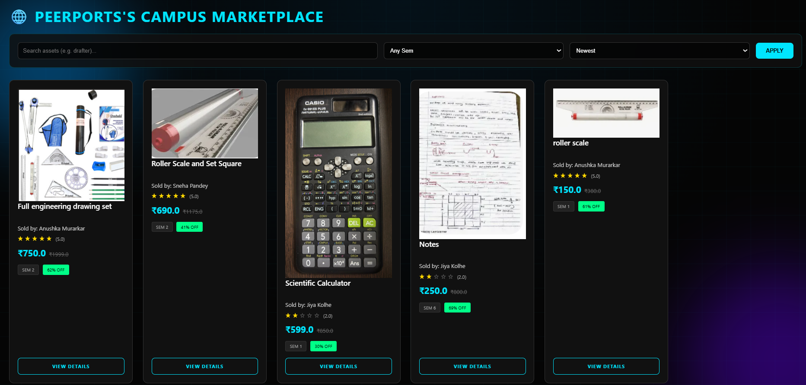
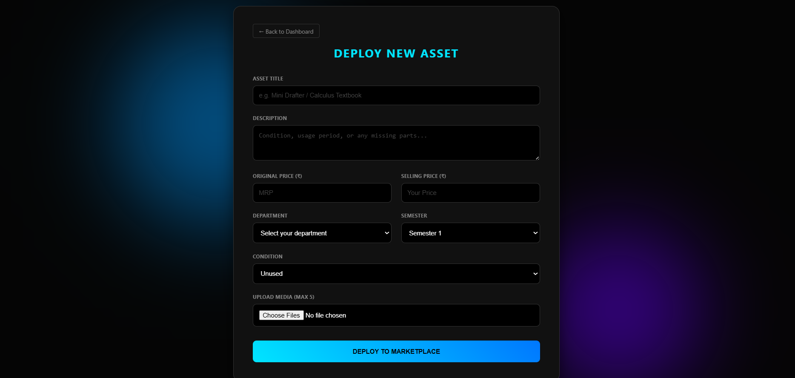

# PeerPort 🌐

### A Secure Intra-Campus Academic Marketplace for APSIT Students

PeerPort is a full-stack web application designed exclusively for students of APSIT. The platform enables students to buy, sell, and exchange academic resources such as textbooks, engineering tools, lab equipment, component kits, and study materials within a trusted campus community.

By restricting access to verified college accounts, PeerPort creates a secure and localized marketplace that encourages resource sharing while reducing academic expenses.

---

## 🚀 Features

### 🔐 Secure Student Authentication

* Access restricted to verified `@apsit.edu.in` email addresses.
* Dual-phase registration process with Moodle ID verification.
* Simulated OTP verification through institutional email workflow.
* Session-based authentication and access control.

### 👤 User Profile Management

* Personalized student profiles.
* Academic information tracking:

  * Department
  * Year
  * Semester
* Profile picture management.
* Contact privacy protection.

### 🛒 Marketplace Functionality

* Create academic product listings.
* Browse available resources.
* View detailed product information.
* Academic category-based filtering.
* Buyer-seller interaction support.

### 🔒 Security Features

* Password hashing using Flask-Bcrypt.
* Strong password validation:

  * Uppercase letters
  * Lowercase letters
  * Numbers
  * Special characters
* Secure session handling.
* Institutional email validation.

### 🎨 User Experience

* Responsive dashboard design.
* Custom-built frontend interface.
* Dynamic JavaScript interactions.
* Academic-focused user workflow.

---

## 🛠️ Tech Stack

### Frontend

* HTML5
* CSS3
* JavaScript (ES6+)
* SVG Assets

### Backend

* Python
* Flask

### Database

* SQLite

### Security

* Flask-Bcrypt
* Regex Validation
* Flask Sessions

### Deployment

* Gunicorn WSGI Server

---

## 📂 Project Structure

```text
PeerPort_Project/
│
├── static/
│   ├── css/
│   ├── js/
│   └── images/
│
├── templates/
│
├── app.py
├── requirements.txt
├── README.md
│
├── update_users.py
├── update_pfp.py
├── update_desc.py
├── update_ratings.py
│
├── update_tx.py
├── force_tx.py
├── check_deals.py
│
└── database utilities
```

---

## ⚙️ Installation & Setup

### 1. Clone Repository

```bash
git clone https://github.com/aditipareekCodes/PeerPort_Project.git
cd PeerPort_Project
```

### 2. Create Virtual Environment

```bash
python -m venv venv
```

Activate:

**Windows**

```bash
venv\Scripts\activate
```

**Linux / MacOS**

```bash
source venv/bin/activate
```

### 3. Install Dependencies

```bash
pip install -r requirements.txt
```

### 4. Run Application

```bash
python app.py
```

### 5. Open Browser

```text
http://127.0.0.1:5000
```

---

## 📸 Application Screenshots

### Login Page



### Registration Page



### Product Listing Page



### Product selling Page 


---

### Check more pages 

/workspaces/PeerPort_Project/docs


## 🗄️ Core Database Modules

The application maintains structured data for:

* Users
* Academic Profiles
* Product Listings
* Transactions
* Ratings
* Contact Information

SQLite is used for local development and can be migrated to PostgreSQL or MySQL for production-scale deployment.

---

## 💡 Concepts Demonstrated

This project demonstrates practical implementation of:

* Full-Stack Web Development
* Authentication & Authorization
* Password Hashing
* Session Management
* Form Validation
* CRUD Operations
* Relational Databases
* Frontend Development
* Backend API Logic
* Secure User Workflows
* Git & GitHub Version Control

---

## 🧩 Challenges Solved

* Restricting platform access exclusively to verified college students.
* Designing a secure registration workflow.
* Protecting user privacy while enabling communication between students.
* Managing academic profile matching and listing visibility.
* Maintaining secure password storage practices.

---

## 🔮 Future Improvements

* Real Email OTP Integration
* Real-Time Chat System
* Product Recommendation Engine
* Advanced Search & Filtering
* Image Upload Optimization
* PostgreSQL Migration
* Mobile Application Support
* Admin Moderation Dashboard
* Transaction History Analytics

---

## 👩‍💻 Author

**Aditi Pareek**

* Full Stack Developer
* APSIT Student

GitHub:
https://github.com/aditipareekCodes

---

## 📜 License

This project is developed for educational and portfolio purposes.

Feel free to fork, learn from, and build upon the project.
